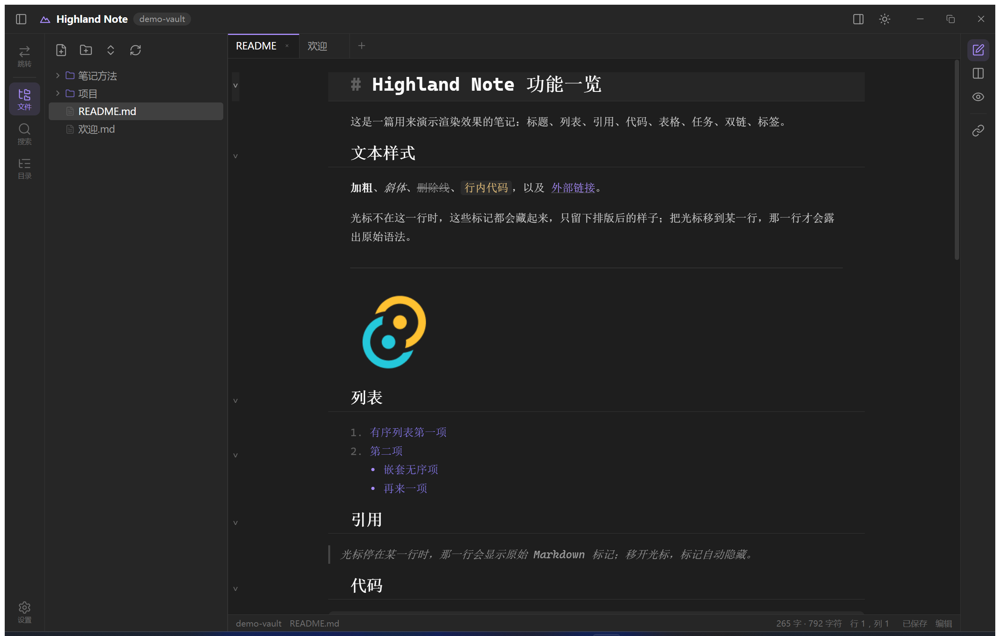
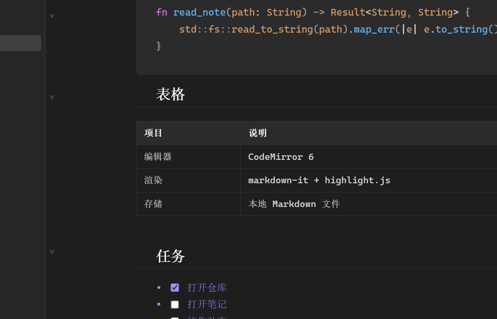
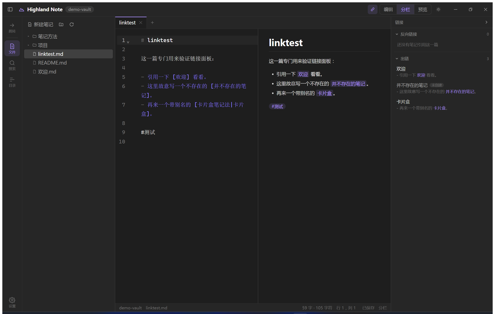
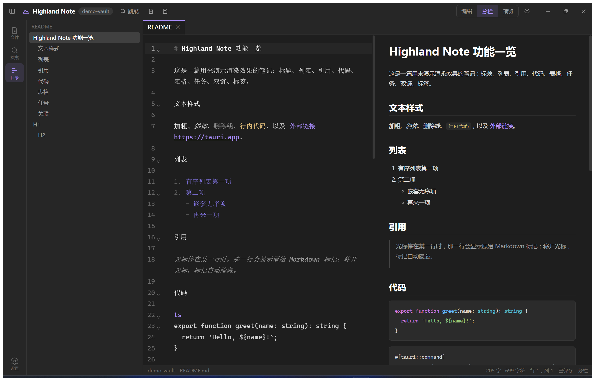
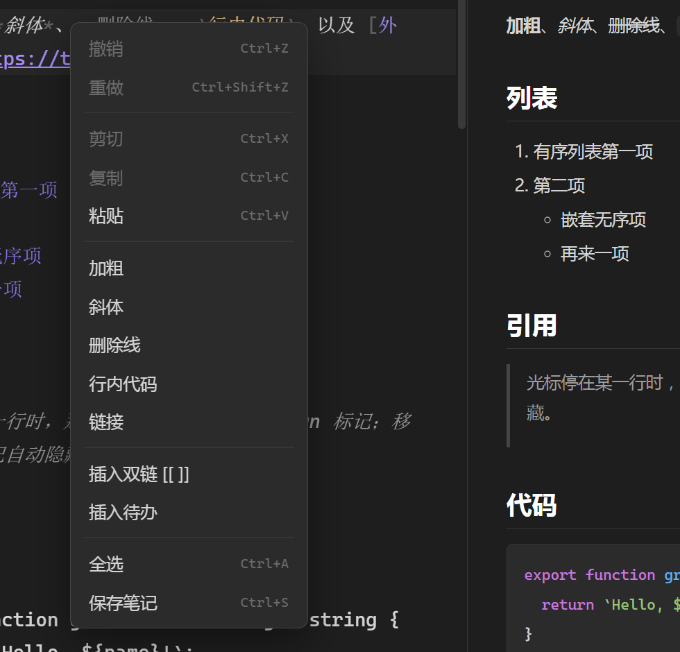

# Highland Note

一个类似 Obsidian 的本地优先 Markdown 笔记应用：**一个文件夹就是一个仓库**，笔记就是普通的 `.md` 文件，
不锁定格式、不依赖数据库，随时能用别的编辑器打开。

技术栈：Tauri 2（Rust 后端）+ Vue 3 + TypeScript + Vite，编辑器用 CodeMirror 6，
渲染用 markdown-it + highlight.js，图标用 lucide。



## 现在能做什么

**仓库与文件**

- 打开任意文件夹作为仓库，记住最近打开的仓库，下次启动自动进入
- 文件树浏览、展开折叠、右键菜单（新建笔记 / 新建文件夹 / 重命名 / 删除 / 移动到根目录）
- 拖拽文件到文件夹完成移动，删除走系统回收站
- 侧边栏宽度可拖动调整

**编辑（所见即所得）**

编辑器里看到的就已经是排版后的样子，不显示 Markdown 标记：

- **标题**按层级放大（1.7 / 1.45 / 1.25 / 1.12em），一级二级带下划线
- `**加粗**`、`*斜体*`、`~~删除线~~` 直接呈现效果；`` `行内代码` `` 是有底色的药丸
- `[文字](地址)` 只留文字并加下划线，地址自动收起；`[[双链]]` 去掉方括号，`#标签` 着色
- `` **直接显示图片**，仓库里的相对路径按「笔记所在目录」解析
- **表格渲染成真表格**（表头底色、边框、单元格里的行内样式照常渲染）；
  把光标移进表格就退回源码，点走再变回表格
- `- [ ] 待办` 变成**可以点的复选框**，点一下直接改写文件里的 `[x]`，勾完的行会变淡
- 无序列表的 `-` 换成圆点，有序列表的序号变淡
- `---` 渲染成分隔线；**代码块有底色、圆角、内边距和完整的语法高亮**（围栏那行正好当语言标签用），
  引用块带左侧竖线
- **代码配色和预览区共用一套 CSS 变量**（One Dark / One Light），改一处两边一起变，切换主题也自动跟随
- **段落之间的空行被压扁**，看起来是段间距而不是空一整行
- **光标在哪一行，那一行就露出原始语法**，方便直接改；移开又恢复渲染
- 底层仍然是 CodeMirror 6：行号、括号匹配、代码块折叠、多光标、撤销历史都在
- 三种视图：仅编辑 / 分栏 / 仅预览（`Ctrl` + `E`）；编辑模式本身已经所见即所得，分栏主要用于对照

> 实现上有一点要注意：**跨行的替换装饰（比如整块表格）CodeMirror 只允许由 `StateField` 提供**，
> 用 ViewPlugin 会直接抛 `RangeError`。所以装饰分成两层——行内的走 ViewPlugin（只算可见区域，省性能），
> 整块替换的走 StateField。



> 为什么不做成 Word 那种富文本编辑器：那需要把文档换成富文本模型，Markdown 只能靠序列化来回转换，
> 而 `[[双链]]`、`^块引用`、`{{挖空}}` 这些自定义写法和表格、空行在往返中很容易被改写。
> 现在这样「文本是真身、渲染是投影」，既拿到了所见即所得的观感，也保住了纯文本可迁移这条底线。
- 分栏中间的**分隔条可以拖动**，随时调整编辑区与预览区的宽度比例；双击分隔条恢复均分，
  比例自动记住（限制在 15% – 85%，不会把某一侧拖没）
- 自动保存（停手约 0.6 秒落盘），`Ctrl` + `S` 立即保存
- 磁盘文件被外部改动时提示覆盖或重新载入，不静默丢数据
- 多标签页，每个标签独立保留撤销历史与光标位置

**双向链接与检索**

- `[[笔记名]]` 双链，支持 `[[笔记名|别名]]`、`[[笔记名#小节]]`；预览或编辑区按住 `Ctrl` 点击即可跳转，
  目标不存在时可一键新建
- **右侧链接面板**（`Ctrl` + `Shift` + `L`，或顶部栏最右的面板开关）显示当前笔记的
  **反向链接**（谁引用了我）与**出链**（我引用了谁）：
  - 每条都带**原文上下文**，链接文字本身高亮，一眼看清是在什么语境里被引用的
  - 点反向链接跳到**引用者**那一行；点出链跳到**被引用**的笔记
  - 指向不存在笔记的链接会标上「未创建」，点一下就能建
  - 面板宽度可拖动，开关状态会记住
- `#标签` 行内标签，点击即在全文中搜索该标签
- 侧边栏全文搜索，逐行显示命中内容与行号，关键词高亮
- `Ctrl` + `P` 按名字快速跳转，没有匹配时回车直接新建



**渲染**

- 标题、列表、表格、引用、代码块（highlight.js 高亮）、任务列表复选框、删除线
- 正文 HTML 经 DOMPurify 过滤后渲染
- 深色 / 浅色主题，编辑器字号与最大宽度可调

**界面布局**

从左到右分成四段，两侧对称：**图标栏负责"选功能"，面板负责"看内容"**。

```
┌────┬──────────────┬──────────────────────┬────────────┬────┐
│ 工 │              │  标签页               │            │ 图 │
│ 具 │  列表面板     ├──────────┬───────────┤  右侧面板   │ 标 │
│ 栏 │ 文件/搜索/目录 │  编辑区   │   预览区   │ (链接/反链) │ 栏 │
│    │              ├──────────┴───────────┤            │    │
│ ⚙  │              │  状态栏               │            │    │
└────┴──────────────┴──────────────────────┴────────────┴────┘
```

- **最左侧工具/菜单栏**：上半是「跳转」这类瞬时动作，下半是列表面板的切换（文件 / 搜索 / 目录），
  设置固定在底部。再点一次当前面板项即收起列表面板；以后加复习、知识树只要往这里加一项
- **列表面板**：同一列里切换三种内容——文件树（`Ctrl` + `Shift` + `E`）、全文搜索
  （`Ctrl` + `Shift` + `F`）、标题大纲（`Alt` + `O`），宽度可拖动。
  文件树顶部是一排等大的图标按钮：新建笔记 / 新建文件夹 / 全部展开折叠 / 刷新，用途看 tooltip
- **内容区**
  - 标签栏：当前标签用编辑区底色连成一片、左上角一条主题色标记，关闭按钮只在悬停或当前标签出现；
    右端的 **`+`** 新建笔记
  - 编辑 / 预览区，中间的分隔条可拖动
  - 状态栏：右下角的**保存状态可以点**，脏了会变成主题色的「未保存」，点一下立即落盘
- **右侧图标栏 + 面板**：和左侧对称。图标行在顶端——左边三个是**视图切换**
  （仅编辑 / 分栏 / 仅预览），右边是面板功能（目前是「链接与反链」），当前项主题色高亮；
  再点一次当前功能即收起面板，收起后只留一条 52px 的竖排图标栏，视图切换依然可用。
  以后再加标签、日历这类右栏功能，只要往 `RightSidebar.vue` 的 `panels` 里加一项
- **顶部栏**：只留应用标识、仓库名、**右侧面板开关**、主题与窗口按钮——纯粹是标题栏

大纲里点击标题即可跳转，光标所在小节会自动高亮：



**窗口外观**

去掉了 Windows 原生的标题栏与边框（`decorations: false`），改由顶部栏兼任标题栏：

- 左侧是应用标识与仓库名徽标，右侧是自绘的最小化 / 最大化 / 关闭按钮，
  样式跟随主题（关闭按钮悬停变红），最大化时图标自动切换为「向下还原」
- 整条顶部栏可拖动移动窗口，双击即最大化 / 还原
- 原生边框去掉后系统不再提供边缘缩放，四边与四角由八个贴边热区接管，鼠标移到边缘会变成缩放光标
- 按钮、输入框等可交互元素不会误触发拖动；窗口变窄时自动收起文字，避免顶栏挤爆

**右键菜单**

WebView 自带的浏览器菜单（表情符号、书写方向、检查…）已经被屏蔽，换成全局统一的应用内菜单，
样式跟随主题，支持方向键选择、回车执行、`Esc` 关闭，并会自动避开窗口边缘：

| 位置 | 菜单内容 |
| --- | --- |
| 编辑器 | 撤销 / 重做，剪切 / 复制 / 粘贴，加粗 / 斜体 / 删除线 / 行内代码 / 链接，插入双链、插入待办，全选、保存 |
| 预览区 | 打开双链、复制笔记名、在浏览器打开、复制链接，复制 / 全选 / 复制整篇 Markdown |
| 标签页 | 关闭 / 关闭其他 / 关闭全部、复制笔记路径 |
| 文件树 | 新建笔记 / 新建文件夹、打开、重命名、复制路径、移动、删除 |
| 搜索结果 | 打开、复制这一行、复制路径 |
| 空白区域 | 新建笔记、快速跳转、保存、开关侧边栏、设置 |

不可用的项（比如没有选中文字时的「剪切」、没有历史时的「撤销」）会自动置灰。
复制粘贴走 Tauri 的剪贴板插件，所以粘贴纯文本比浏览器环境更可靠。



## 怎么跑起来

需要 Node.js、pnpm 和 Rust 工具链。

```bash
pnpm install
pnpm tauri dev      # 开发模式：启动 Vite 并打开应用窗口
pnpm tauri build    # 打包发布版本（安装包在 src-tauri/target/release/bundle）
```

只检查前端类型和构建：

```bash
pnpm build          # vue-tsc --noEmit && vite build
cargo build --manifest-path src-tauri/Cargo.toml
```

首次运行会停在欢迎页，点「打开文件夹作为仓库」即可；仓库里已经放了 `demo-vault/` 示例，
里面有几篇互相链接的笔记，可以直接打开来看效果。

## 快捷键

| 快捷键 | 功能 |
| --- | --- |
| `Ctrl` + `N` | 新建笔记 |
| `Ctrl` + `P` | 快速跳转 / 新建 |
| `Ctrl` + `S` | 立即保存 |
| `Ctrl` + `E` | 编辑 / 分栏 / 预览 循环切换 |
| `Ctrl` + `B` | 显示或隐藏列表面板 |
| `Ctrl` + `W` | 关闭当前标签页 |
| `Alt` + `O` | 切到目录（再按一次回到文件） |
| `Ctrl` + `Shift` + `L` | 显示 / 收起右侧链接面板 |
| `Ctrl` + `Shift` + `E` | 切到文件面板 |
| `Ctrl` + `Shift` + `F` | 切到全文搜索 |
| `Ctrl` + `Shift` + `O` | 切换仓库 |
| `Ctrl` + `Tab` | 下一个标签页 |
| `Ctrl` + `,` | 设置 |
| `Ctrl` + 点击 `[[链接]]` | 跳转到目标笔记 |

## 代码结构

```
src-tauri/src/
  lib.rs         Tauri 命令：仓库开关、笔记读写、搜索、链接索引、设置
  vault.rs       仓库模型：目录树扫描、笔记 CRUD、全文搜索、路径越界校验
  links.rs       仓库级链接索引：解析 `[[双链]]`，按 mtime 增量缓存，算出链与反链
  settings.rs    设置持久化（系统配置目录下的 settings.json）

src/
  App.vue              自绘标题栏与窗口按钮、整体布局、全局快捷键、空白区右键菜单
  components/
    SideBar.vue        文件树与搜索面板、右键菜单、拖拽
    ActivityRail.vue   最左侧工具/菜单栏
    OutlinePanel.vue   标题大纲（列表面板的一页）
    LinkPanel.vue      右侧链接与反链面板
    TreeNode.vue       递归的文件树节点
    TabBar.vue         标签页
    EditorPane.vue     CodeMirror 宿主，按标签页保存编辑器状态，编辑器右键菜单
    PreviewPane.vue    渲染后的预览，处理双链 / 标签 / 外链点击与右键菜单
    ContextMenu.vue    通用的自定义右键菜单（定位、键盘导航）
    StatusBar.vue      字数统计、光标位置、保存状态
    QuickSwitcher.vue  快速跳转浮层
    ModalHost.vue      输入框与确认框
    SettingsPanel.vue  设置面板
  lib/
    api.ts         Tauri 命令的类型化封装
    store.ts       全局状态与业务动作（打开、保存、重命名、搜索、菜单……）
    editor.ts      CodeMirror 扩展、主题、所见即所得的渲染装饰
    markdown.ts    markdown-it 配置、双链与标签插件、渲染与统计
    assets.ts      把笔记里的图片路径解析成 webview 能加载的地址
    outline.ts     标题大纲解析
    format.ts      Markdown 排版操作（加粗、链接、双链、待办……）
    clipboard.ts   剪贴板读写（Tauri 插件 + 浏览器回退）
    dnd.ts         拖拽状态
```

设计上所有文件读写都走 Rust 命令，前端不直接碰文件系统；对外路径统一为「相对仓库根、以 `/` 分隔」，
由 Rust 侧校验，避免越界访问仓库外的文件。

## RNote：Note — Block — Card 三层知识结构

在笔记之上再叠一层"可提问"的结构，把「读过」变成「会用」：

- **Note**（一篇 Markdown）→ **Block**（一句原子陈述）→ **Card**（对 Block 的提问）
- 提问写在笔记里，**复习进度写在笔记外**（仓库的 `.rnote/`），互不干扰
- 格式是纯 Markdown，`^id` 用的就是 Obsidian 的块引用语法，不锁定、不丢数据

| 文档 | 内容 |
| --- | --- |
| [RNote 设计文档](docs/rnote-design.md) | 产品补全 + 数据格式 + 界面 + 算法 + 架构 + 路线图 |
| [RNote 产品文档](docs/rnote-product-doc.md) | 原始构想（三层模型、知识树隐喻） |
| [格式样例](docs/rnote-sample.md) | 一份真实可解析的 RNote 笔记 |

解析器已经写完并验证：`src/lib/rnote.ts`，跑 `pnpm check:rnote` 执行 24 项断言。

## 后面可以加

- [ ] 反链面板（谁引用了我）与未链接提及
- [ ] 标签面板、按标签浏览
- [ ] 图谱视图
- [ ] 每日笔记一键创建
- [ ] 图片粘贴与附件目录管理
- [ ] 大纲 / 目录面板
- [ ] 多仓库同时打开、工作区
- [ ] 命令面板
- [ ] RNote 阶段一：编辑器 Block 装饰、造卡面板、复习视图、SM-2 排期
