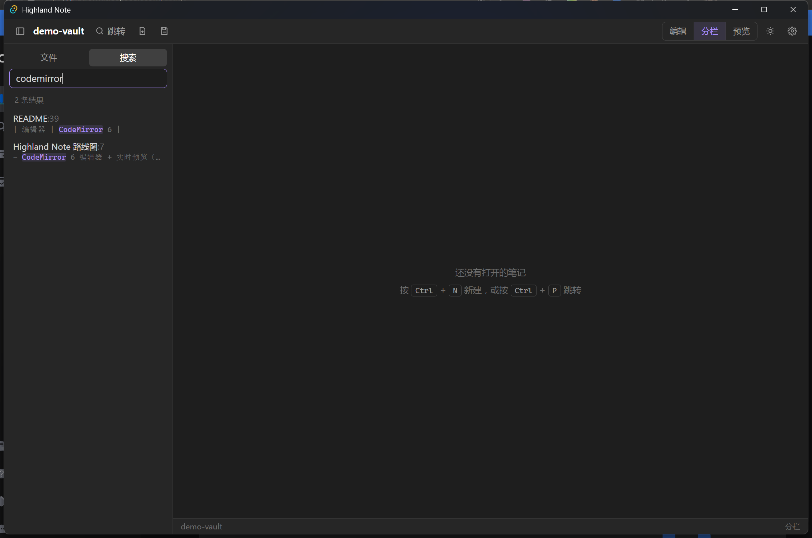

# Highland Note

一个类似 Obsidian 的本地优先 Markdown 笔记应用：**一个文件夹就是一个仓库**，笔记就是普通的 `.md` 文件，
不锁定格式、不依赖数据库，随时能用别的编辑器打开。

技术栈：Tauri 2（Rust 后端）+ Vue 3 + TypeScript + Vite，编辑器用 CodeMirror 6，渲染用 markdown-it + highlight.js。


## 现在能做什么

**仓库与文件**

- 打开任意文件夹作为仓库，记住最近打开的仓库，下次启动自动进入
- 文件树浏览、展开折叠、右键菜单（新建笔记 / 新建文件夹 / 重命名 / 删除 / 移动到根目录）
- 拖拽文件到文件夹完成移动，删除走系统回收站
- 侧边栏宽度可拖动调整

**编辑**

- CodeMirror 6 Markdown 编辑器：语法着色、行号、括号匹配、代码块折叠、多光标
- 实时预览：光标不在某行时自动隐藏 `#`、`**`、`` ` `` 等标记，光标移入该行即显示原始语法
- 三种视图：仅编辑 / 分栏 / 仅预览（`Ctrl` + `E` 循环切换）
- 分栏中间的**分隔条可以拖动**，随时调整编辑区与预览区的宽度比例；双击分隔条恢复均分，
  比例自动记住（限制在 15% – 85%，不会把某一侧拖没）
- 自动保存（停手约 0.6 秒落盘），`Ctrl` + `S` 立即保存
- 磁盘文件被外部改动时提示覆盖或重新载入，不静默丢数据
- 多标签页，每个标签独立保留撤销历史与光标位置

**双向链接与检索**

- `[[笔记名]]` 双链，支持 `[[笔记名|别名]]`；预览或编辑区按住 `Ctrl` 点击即可跳转，目标不存在时可一键新建
- `#标签` 行内标签，点击即在全文中搜索该标签
- 侧边栏全文搜索，逐行显示命中内容与行号，关键词高亮
- `Ctrl` + `P` 按名字快速跳转，没有匹配时回车直接新建



**渲染**

- 标题、列表、表格、引用、代码块（highlight.js 高亮）、任务列表复选框、删除线
- 正文 HTML 经 DOMPurify 过滤后渲染
- 深色 / 浅色主题，编辑器字号与最大宽度可调

**窗口外观**

去掉了 Windows 原生的标题栏与边框（`decorations: false`），改由顶部栏兼任标题栏：

- 左侧是应用标识与仓库名徽标，右侧是自绘的最小化 / 最大化 / 关闭按钮，
  样式跟随主题（关闭按钮悬停变红），最大化时图标自动切换为「向下还原」
- 整条顶部栏可拖动移动窗口，双击即最大化 / 还原
- 原生边框去掉后系统不再提供边缘缩放，四边与四角由八个贴边热区接管，鼠标移到边缘会变成缩放光标
- 按钮、输入框等可交互元素不会误触发拖动；窗口变窄时自动收起文字，避免顶栏挤爆

**右键菜单**

WebView 自带的浏览器菜单（表情符号、书写方向、检查…）已经被屏蔽，换成全局统一的应用内菜单，
样式跟随主题，支持方向键选择、回车执行、`Esc` 关闭，并会自动避开窗口边缘：

| 位置 | 菜单内容 |
| --- | --- |
| 编辑器 | 撤销 / 重做，剪切 / 复制 / 粘贴，加粗 / 斜体 / 删除线 / 行内代码 / 链接，插入双链、插入待办，全选、保存 |
| 预览区 | 打开双链、复制笔记名、在浏览器打开、复制链接，复制 / 全选 / 复制整篇 Markdown |
| 标签页 | 关闭 / 关闭其他 / 关闭全部、复制笔记路径 |
| 文件树 | 新建笔记 / 新建文件夹、打开、重命名、复制路径、移动、删除 |
| 搜索结果 | 打开、复制这一行、复制路径 |
| 空白区域 | 新建笔记、快速跳转、保存、开关侧边栏、设置 |

不可用的项（比如没有选中文字时的「剪切」、没有历史时的「撤销」）会自动置灰。
复制粘贴走 Tauri 的剪贴板插件，所以粘贴纯文本比浏览器环境更可靠。


## 怎么跑起来

需要 Node.js、pnpm 和 Rust 工具链。

```bash
pnpm install
pnpm tauri dev      # 开发模式：启动 Vite 并打开应用窗口
pnpm tauri build    # 打包发布版本（安装包在 src-tauri/target/release/bundle）
```

只检查前端类型和构建：

```bash
pnpm build          # vue-tsc --noEmit && vite build
cargo build --manifest-path src-tauri/Cargo.toml
```

首次运行会停在欢迎页，点「打开文件夹作为仓库」即可；仓库里已经放了 `demo-vault/` 示例，
里面有几篇互相链接的笔记，可以直接打开来看效果。

## 快捷键

| 快捷键 | 功能 |
| --- | --- |
| `Ctrl` + `N` | 新建笔记 |
| `Ctrl` + `P` | 快速跳转 / 新建 |
| `Ctrl` + `S` | 立即保存 |
| `Ctrl` + `E` | 编辑 / 分栏 / 预览 循环切换 |
| `Ctrl` + `B` | 显示或隐藏侧边栏 |
| `Ctrl` + `W` | 关闭当前标签页 |
| `Ctrl` + `Shift` + `F` | 打开全文搜索 |
| `Ctrl` + `Shift` + `O` | 切换仓库 |
| `Ctrl` + `Tab` | 下一个标签页 |
| `Ctrl` + `,` | 设置 |
| `Ctrl` + 点击 `[[链接]]` | 跳转到目标笔记 |

## 代码结构

```
src-tauri/src/
  lib.rs         Tauri 命令：仓库开关、笔记读写、搜索、设置
  vault.rs       仓库模型：目录树扫描、笔记 CRUD、全文搜索、路径越界校验
  settings.rs    设置持久化（系统配置目录下的 settings.json）

src/
  App.vue              自绘标题栏与窗口按钮、整体布局、全局快捷键、空白区右键菜单
  components/
    SideBar.vue        文件树与搜索面板、右键菜单、拖拽
    TreeNode.vue       递归的文件树节点
    TabBar.vue         标签页
    EditorPane.vue     CodeMirror 宿主，按标签页保存编辑器状态，编辑器右键菜单
    PreviewPane.vue    渲染后的预览，处理双链 / 标签 / 外链点击与右键菜单
    ContextMenu.vue    通用的自定义右键菜单（定位、键盘导航）
    StatusBar.vue      字数统计、光标位置、保存状态
    QuickSwitcher.vue  快速跳转浮层
    ModalHost.vue      输入框与确认框
    SettingsPanel.vue  设置面板
  lib/
    api.ts         Tauri 命令的类型化封装
    store.ts       全局状态与业务动作（打开、保存、重命名、搜索、菜单……）
    editor.ts      CodeMirror 扩展、主题、实时预览插件
    markdown.ts    markdown-it 配置、双链与标签插件、渲染与统计
    format.ts      Markdown 排版操作（加粗、链接、双链、待办……）
    clipboard.ts   剪贴板读写（Tauri 插件 + 浏览器回退）
    dnd.ts         拖拽状态
```

设计上所有文件读写都走 Rust 命令，前端不直接碰文件系统；对外路径统一为「相对仓库根、以 `/` 分隔」，
由 Rust 侧校验，避免越界访问仓库外的文件。

## 后面可以加

- [ ] 反链面板（谁引用了我）与未链接提及
- [ ] 标签面板、按标签浏览
- [ ] 图谱视图
- [ ] 每日笔记一键创建
- [ ] 图片粘贴与附件目录管理
- [ ] 大纲 / 目录面板
- [ ] 多仓库同时打开、工作区
- [ ] 命令面板
